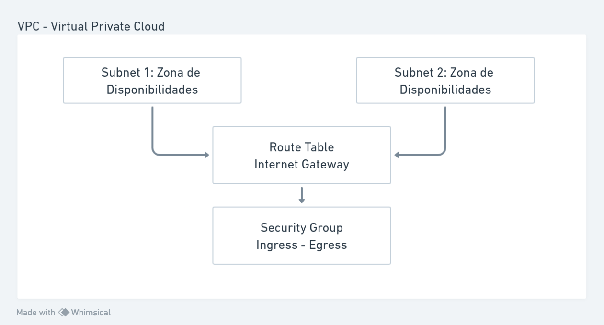

<h1 align="center">
  
  <br>
  Terraform<br>
  Desenvolvendo Uma VPN Com 2 Kubnetes Utilizando Módulos
</h1>

<div align="center">
        
</div>


<div align="center">

[]()
[]()

</div>

<hr>

### Neste repositório contém o mesmo código do `02.01-CLuster-Kubernetes`, o código foi modificado para trabalhar com modulos deixando o código mais legivel e com menos arquivos. 


* Arquivo inicial para criar e configurar os provedores e infraestrutura.
* backemd: Salvar o `terraform.tfstate` no bucket S3 ao invés de salvar na máquina local. Muito útil para trabalho em equipe.
`main.tf`
```
terraform {
    required_version = ">=0.13.1"
    required_providers {
        aws = ">=5.26.0"
        local = ">=2.4.0"
  }
  
  backend "s3" {
    bubucket = "meu-bucket"    
    key = "terraform.tfstate"
    region = "us-east-1"
  }
}
```
Região onde vai ser alocado o serviço.
```
provider "aws" {
    region = "us-east-1" # USA Virginia
}

```
Criação dos modulos, cada pasta do `modules` contém os arquivos para criação de cada serviço.<br>
Código para utilizaro os módulos.
```
module "new-vpc" {
  source = "./modules/vpc"
  prefix = var.prefix
  vpc_cidr_block = var.vpc_cidr_block
}

module "eks" {
  source = "./modules/eks"
  prefix = var.prefix
  vpc_id = new-vpc.vpc_id
  cluster_name = var.cluster_name
  retention_days = var.retention_days
  subnet_ids = module.new-vpc.subnet_ids
  desired_size = var.desired_size
  max_size = var.max_size
  min_size = var.min_size
}
```